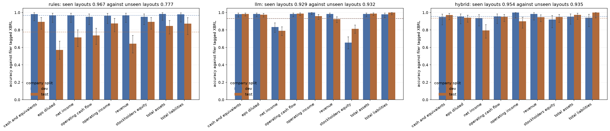
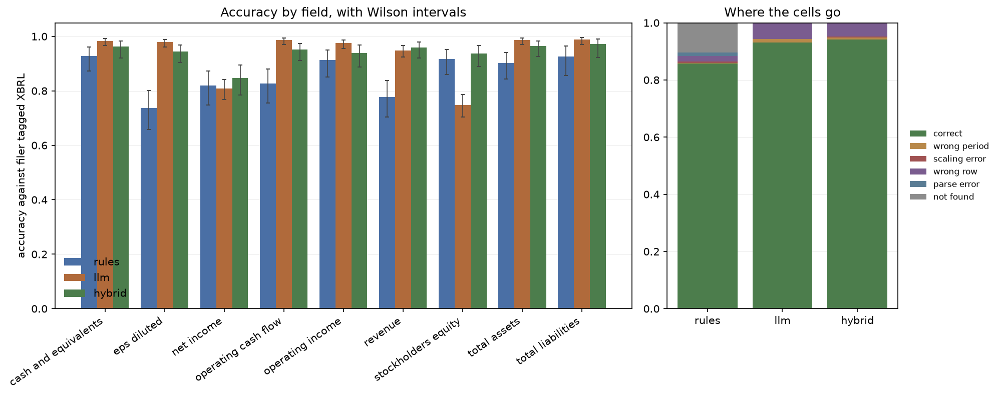

# Extracting financial facts from filings: rules against a language model

I built this to answer a question with measurements instead of an opinion:
should a document extraction pipeline replace its regular expressions with a
language model?

The claim I set out to test, stated before I had any results so that the result
could contradict it:

> A language model does not beat rules uniformly on this task. It wins on the
> fields where layout varies and loses, on accuracy or on cost, where the target
> is regular.

The claim is now tested, and it is half right in a way that is more useful than
either being wholly right or wholly wrong would have been.

The model wins where I said it would, by a lot, and on the whole task rather
than only on the awkward fields. It loses on exactly one field, and on cost and
latency. The prediction about *which* fields it would win was correct and was
written down before anything was run.

## Headline

Accuracy over the same 1,225 labelled cells, split by whether the company was
one of the ten I developed the rules against:

| method | development | test | both |
| --- | --- | --- | --- |
| hand written rules | **0.9672** | **0.7765** | 0.8571 |
| language model | 0.9292 | **0.9321** | 0.9309 |
| hybrid, model asked only where rules abstained | 0.9540 | **0.9347** | 0.9417 |

**The rules extractor has a nineteen point generalisation gap and the model has
none.** Rules fall from 0.9672 to 0.7765 between layouts they were built against
and layouts they have never seen. The model scores 0.9292 and 0.9321, which is
the same number twice. That is the whole finding in one line: most of what looked
like extraction skill in the rules was fitting to ten companies' house styles,
and a model that was never fitted to any of them does not have that problem.

Rules still win on the development split, by 3.8 points, which is what ten
iterations of tuning against those ten companies buys. It is not a real
advantage on anything the extractor has not seen before.

The rules extractor in more detail, since its behaviour is the thing the model
is being compared against:

| Split | Companies | Cells | Accuracy | 95 percent interval | Answer rate | Precision when it answers |
|---|---|---|---|---|---|---|
| Development | 10 | 518 | 0.9672 | 0.9481 to 0.9794 | 0.9749 | 0.9921 |
| Test | 14 | 707 | 0.7765 | 0.7444 to 0.8057 | 0.8373 | 0.9274 |
| Both | 24 | 1225 | 0.8571 | 0.8364 to 0.8756 | 0.8955 | 0.9572 |

**On unseen layouts the rules mostly decline to answer rather than answering
wrongly.** Sixteen percent of test cells come back empty, but of the cells it
does answer, 92.7 percent are right. An extractor that abstains leaves a gap
someone can fill; one that returns a plausible wrong number puts a bad figure in
the database and nobody finds out. That property is what makes the hybrid worth
building, and it is why the hybrid beats the model alone on the test split:
where the rules do answer they are nearly always right, and the model is asked
only about the rest.



Every number in this document was produced by running the code in this
repository. Nothing is recalled or estimated.

## What makes this benchmark honest, and the decision it rests on

Every 10-K in this window is inline XBRL. The filer has already wrapped each
reportable figure in a tag naming its exact accounting concept:

```html
<ix:nonFraction name="us-gaap:Assets" scale="6" ...>364,980</ix:nonFraction>
```

That tag carries the same information my ground truth comes from. If an
extractor could see it, four lines of regular expression would score one hundred
percent and the benchmark would measure nothing at all.

So I strip it. The inline XBRL header is removed, every `ix:` element is
unwrapped down to its visible text, and both extractors read the rendered page
the way a person would. Across the 144 filings this removes **277,347 tagged
facts** from 23,798 tables. This is the assumption to attack first, and I want it
attacked in the open rather than buried: I deliberately made the task hard,
because the easy version is not the question anyone is really asking.

## Ground truth, and what it does and does not mean

Labels come from the SEC XBRL company facts API, joined to filings by accession
number and period end. No hand annotation, which is what makes a sample this
size possible.

**XBRL is tagged by the filer.** A value here is what the company asserted it
reported under that concept. Accuracy measured against it is agreement with the
filer, not agreement with truth. Where a filer tagged something oddly, my
extractor is marked wrong for reading the page correctly, and I have left those
cases in rather than removing them.

Two traps, both handled:

**Period matching.** An annual report prints comparatives, so one concept has
several facts under a single fiscal year. Apple's fiscal 2024 report carries
three revenue facts, ending 2022-09-24, 2023-09-30 and 2024-09-28. Matching on
fiscal year alone would silently pick the wrong one about half the time and it
would look like an extractor failure. Every match here is on period end date.

**Deduplication.** The same period appears in several filings, because next
year's report repeats this year's figure. My rule: a filing is the source of
truth only for its own reporting period, so a fact counts only when its period
end equals the filing's report date. A later restatement of an earlier period is
therefore never used, which is correct here, because the question is whether an
extractor can read the number printed on that filing's page.

### Coverage

1,225 labelled cells over 144 filings. 79 filings have all nine fields, and the
average filing has 8.51 of 9. The gaps are not data defects:

| Field | Missing | Why |
|---|---|---|
| `total_liabilities` | 49 of 144 | Eight companies never tag `Liabilities`, because their balance sheet prints no total liabilities subtotal at all |
| `operating_income` | 18 of 144 | Johnson and Johnson, Merck and Pfizer run from gross profit to pre-tax income with no operating income line |
| `cash_and_equivalents` | 4 of 144 | 3M tagged neither accepted concept in four of its six filings |

The label is absent precisely because the number is absent from the page, so
those cells are excluded from scoring rather than counted as failures. Nobody
can be marked wrong on a question the document does not answer.

### Concept names are not stable, and here is how unstable

Each field is defined as an ordered list of acceptable concepts, committed in
`config/fields.json`. How often each alternative was the one that matched:

| Field | Concept | Share |
|---|---|---|
| revenue | `RevenueFromContractWithCustomerExcludingAssessedTax` | 59.7 percent |
| revenue | `Revenues` | 40.3 percent |
| stockholders_equity | `StockholdersEquity` | 83.3 percent |
| stockholders_equity | `StockholdersEquityIncludingPortionAttributableToNoncontrollingInterest` | 16.7 percent |
| cash_and_equivalents | `CashAndCashEquivalentsAtCarryingValue` | 89.3 percent |
| cash_and_equivalents | `CashCashEquivalentsRestrictedCashAndRestrictedCashEquivalents` | 10.7 percent |
| net_income | `NetIncomeLoss` | 95.8 percent |
| net_income | `ProfitLoss` | 4.2 percent |
| operating_cash_flow | `NetCashProvidedByUsedInOperatingActivities` | 93.8 percent |
| operating_cash_flow | `NetCashProvidedByUsedInOperatingActivitiesContinuingOperations` | 6.2 percent |

Revenue splitting almost evenly between two concepts is the reason a single
concept name is not a usable field definition. Full table in
`results/concept_match_counts.csv`.

## The universe

24 large capitalisation US filers, ten industry groups, form 10-K only, report
years 2019 to 2024. Six filings each, 144 in total, no gaps. The list was fixed
in `config/universe.json` before any extraction ran.

I excluded financial sector filers on purpose. Banks and insurers file a
structurally different income statement with no gross profit and no conventional
operating income, so including them would have confounded a field shape effect
with a sector effect.

The whole fetch is 735 MB of documents, cached to disk. Median filing is 4.0 MB
of HTML, largest is 11.3 MB. Reruns do no network work.

## The split, and why it is by company

Development is 10 companies, test is 14. The split is by **company**, not by
filing, and it was frozen before I wrote a line of the extractor.

Layout belongs to a company and its filing agent. Splitting by filing would have
put five years of one house style in development and the sixth in test, which
measures memorising a layout rather than generalising to a new one. That choice
is the reason this README can report a nineteen point gap instead of a
comfortable single number.

Apple sits in development by hand rather than by the draw, because its fiscal
2024 report is the document I read while designing the table parser, before the
split existed. Putting it in test would have been dishonest. Every other company
was assigned from a stream derived from the single documented root seed.

## What the rules extractor does

Not a straw man. A weak baseline would make any model look good, so this does
the four things a competent hand written pipeline does.

1. **Find the statement.** A 10-K holds around 165 tables. The caption above the
   table decides, and anchor rows inside it only break ties, because a note table
   that reuses statement vocabulary is the main false positive. Tables with fewer
   than three rows carrying two or more figures are rejected outright, as are
   interim tables and anything introduced by note language.
2. **Resolve the label.** Ordered patterns per field, held in configuration, with
   exclusion patterns that veto a label and section patterns that read the
   heading above a row.
3. **Resolve the column.** Full dates in the header where they exist, fiscal year
   labels where they do not, and the leftmost column as a last resort.
4. **Apply the scale.** From the caption above the table, or from a caption cell
   inside it, since four of the twenty four companies put it there.

Each of these was forced by a real filing, and each is a trap worth naming:

| Trap | Filing |
|---|---|
| The contents page outscores the statement it points to | 3M 2019 lists every note by name |
| A segment reconciliation reads like an income statement | Oracle's total margin table |
| The quarterly results table has identical row labels | Meta's 10-K, which returns a Q4 figure |
| "Fiscal 2023" heads a year ended 28 January 2024 | Home Depot |
| The scale caption is inside the table and omits "in" | 3M and Pfizer write "(Millions...)" |
| The statement title is broken mid word by markup | 3M renders "Consolidated Statement of Incom e" |
| Three rows share one identical label | Pfizer prints net income, basic EPS and diluted EPS all labelled "Net income attributable to Pfizer Inc. common shareholders"; only the heading above tells them apart |
| Total equity is not stockholders equity | 3M prints 3,894 and 3,842; XBRL means the second |
| Consolidated net income is not net income | PepsiCo prints 9,626 and 9,578; XBRL means the second |

The extractor went through ten revisions, all measured against the development
split only. The test split was scored once, after the rules were frozen. I did
read test failures afterwards for the failure analysis below, and I did not
change the extractor after reading them.

## Results by field



| Field | Test n | Test accuracy | 95 percent interval |
|---|---|---|---|
| stockholders_equity | 84 | 0.893 | 0.809 to 0.943 |
| cash_and_equivalents | 84 | 0.893 | 0.809 to 0.943 |
| operating_income | 72 | 0.875 | 0.779 to 0.933 |
| total_liabilities | 47 | 0.872 | 0.748 to 0.940 |
| total_assets | 84 | 0.845 | 0.753 to 0.907 |
| operating_cash_flow | 84 | 0.738 | 0.635 to 0.820 |
| net_income | 84 | 0.714 | 0.610 to 0.800 |
| revenue | 84 | 0.643 | 0.536 to 0.737 |
| eps_diluted | 84 | 0.571 | 0.465 to 0.672 |

The ordering is explainable from field shape, and it was predictable in advance.

**Balance sheet fields do best.** `total_assets`, `total_liabilities`,
`stockholders_equity` and `cash_and_equivalents` sit at 0.85 to 0.89. Their
labels are near universal, the statement has two columns rather than three, and
there is one obvious subtotal per concept.

**Income statement fields do worst.** `revenue` at 0.643 and `eps_diluted` at
0.571 are the fields where the printed label varies most: revenue is "Total net
sales", "Total revenues", "Net operating revenues" or "Total revenues and other
income" depending on the filer, and diluted earnings per share is sometimes not
labelled at all on its own row.

That is exactly the shape of field where I expected a language model to win, and
it is the prediction this project was built to test. It was written down before
the model was run. It was right.

### The prediction, scored

Test split accuracy per field, both methods, ordered by how much the model beat
the rules:

| Field | rules | model | hybrid | model minus rules |
|---|---|---|---|---|
| eps_diluted | 0.571 | **0.976** | 0.940 | **+0.405** |
| revenue | 0.643 | **0.925** | 0.947 | **+0.282** |
| operating_cash_flow | 0.738 | 0.988 | 0.951 | +0.250 |
| total_assets | 0.845 | 0.988 | 0.973 | +0.143 |
| total_liabilities | 0.872 | 1.000 | 1.000 | +0.128 |
| cash_and_equivalents | 0.893 | 0.984 | 0.971 | +0.091 |
| operating_income | 0.875 | 0.958 | 0.900 | +0.083 |
| net_income | 0.714 | 0.790 | 0.794 | +0.075 |
| stockholders_equity | 0.893 | 0.813 | 0.949 | **-0.079** |

**The two largest gains are the two fields I named in advance as the ones whose
printed label varies most.** `eps_diluted` goes from 0.571 to 0.976 and
`revenue` from 0.643 to 0.925. The model is not uniformly better by a constant:
it is most better exactly where a regular expression has to guess which of four
printed labels means the same concept.

**`stockholders_equity` is the one field where the rules win**, 0.893 against
0.813, and the reason is the trap already documented above. 3M prints total
equity and stockholders equity as adjacent lines, 3,894 and 3,842, and XBRL
means the second. A rule can encode that distinction exactly. The model reads
the page like a person and picks the total, which is the more natural reading of
the words and the wrong answer here. That is the shape of the "loses where the
target is regular" half of the claim, and it turns up in exactly one place
rather than the several I expected.

**The hybrid recovers it.** On `stockholders_equity` the hybrid scores 0.949,
above both the rules at 0.893 and the model at 0.813, because the rules answer
that field confidently and correctly and the model is never asked. That is the
routing rule doing what it was designed to do rather than a lucky average.

## Failure analysis

Failures are classified into kinds, because a scaling error and a wrong row are
both incorrect but mean different things and call for different fixes. Test set
mix:

| Outcome | Share of test cells |
|---|---|
| correct | 77.7 percent |
| not_found | 16.3 percent |
| wrong_row | 3.0 percent |
| parse_error | 2.0 percent |
| scaling_error | 0.8 percent |
| wrong_period | 0.3 percent |

I read a sample of 19 wrong cells, drawn reproducibly from the root seed and
spread across outcome kinds. The full annotated sample, with the statement row
the extractor actually read and its neighbours, is in
`results/failure_sample.csv`. Three representative cases:

**Johnson and Johnson, net income, four filings, scaling error.** The caption
reads "(Dollars and Shares in Millions Except Per Share Amounts)". My scale
detector has a guard that ignores share count scales, and that guard checks the
words before "in". Here those words are "Dollars and Shares", so the guard fires
and rejects a caption that states both. The extractor returns 35,153 instead of
35.153 billion. Unambiguous on the page; entirely my bug.

**Walmart, net income, wrong row.** Walmart prints "Consolidated net income"
(16,270) and "Consolidated net income attributable to Walmart" (15,511). XBRL
`NetIncomeLoss` means the second. My patterns for the attributable row require
the label to begin with "net income", so Walmart's falls through to the
consolidated pattern. A one line config fix, which I have **not** applied,
because applying it would turn the reported test number into a tuned number.

**Merck, operating cash flow, wrong row.** Two rows exist: "Net cash provided by
operating activities of continuing operations" (19,095, which is what the filer
tagged) and "Net cash provided by operating activities" (987). My exact match
pattern hits the second. This is the closest to genuinely ambiguous in the
sample, since resolving it requires knowing which line the filer chose to tag.

**How many were genuinely ambiguous in the document? Essentially none.** Of the
19 sampled, a careful human reader would get 18 right from the page alone, and
the Merck case needs knowledge of the filer's tagging rather than better
reading. The failures are extractor limitations, not document ambiguity. That is
the honest reading, and it is the reading that most favours a language model,
since it means the remaining errors are the kind a competent reader does not
make.

## Cost and speed

The rules extractor costs no money and runs at **0.43 seconds per filing**,
including parsing 4 MB of HTML. A full end to end run over all 144 filings with
a warm cache takes **67 seconds**:

| Stage | Seconds |
|---|---|
| fetch (cached) | 4.3 |
| ground truth | 5.4 |
| rules extraction | 54.8 |
| scoring | 1.2 |
| report and figures | 1.5 |
| total | 67.2 |

A cold run adds the download: 144 documents, 749 MB, about 144 seconds at the
SEC rate limit. Cost per correct field for the rules method is zero, which is the
number the model has to be compared against.

### What the model costs

Measured over the three runs actually used for the accuracy figures above, on
Gemini 2.5 Flash-Lite through Vertex AI:

| | per run | three runs |
|---|---|---|
| input tokens | 14,076,286 | 42,228,858 |
| output tokens | 26,640 | 79,917 |
| cost | **$1.42** | **$4.25** |
| wall clock | about 13 minutes | 41 minutes |

That is **97,752 input tokens and about one US cent per filing**, and 5.6
seconds per filing against the rules extractor's 0.43. So the model is roughly
thirteen times slower and costs a cent where the rules cost nothing, in exchange
for 15.6 points of accuracy on layouts neither method has seen.

Whether that trade is worth taking is a volume question rather than a modelling
one. At 144 filings it is four dollars. At a hundred thousand filings a year it
is about a thousand dollars and three weeks of wall clock at this concurrency,
and the sensible shape is the hybrid: rules first, model only on the sixteen
percent of cells the rules decline, which cuts the model's share of the work by
roughly six times while scoring higher than either alone.

The token count is identical to the digit across all three runs, which is what
you would expect from a fixed prompt over a fixed corpus and is a useful check
that nothing varied in the input.

Rates are in `config/pricing.json` with the date they were read. The code
returns no cost at all while a rate is null, so a cost figure cannot reach a
result table without a dated rate behind it.

## Reproducing

```bash
cp .env.example .env    # set SEC_USER_AGENT to a real contact address
pip install -r requirements.txt
make demo
```

`make demo` runs fetch, ground truth, both extractors and the report end to end.
The language model stage prints that it is skipping and why when no endpoint is
reachable, and the rules half is unaffected, so the whole benchmark still runs
with no model access at all.

Selecting the model is one environment variable:

```bash
FILINGBENCH_MODEL=google/gemini-2.5-flash-lite   # Vertex, needs GCP_PROJECT_ID and gcloud login
```

The Vertex path holds no static key. It fetches a short lived access token from
the gcloud CLI and refreshes it mid run, because a full pass outlasts a token's
lifetime and a mid run expiry would otherwise be recorded as a model failure.
Rate limited and transient responses are retried with exponential backoff for the
same reason: a 429 is an infrastructure event and recording it as a wrong answer
would understate the model for reasons that have nothing to do with the model.

```bash
make test                                   # 32 tests, no network, no API key
python3 scripts/check_determinism.py        # proves two runs are identical
```

The rules half is deterministic. Two consecutive runs produce byte identical
extraction tables, digest `99ad1b422d9b8b48d93ba23b781e48ca1ed28f4584a54caece1d44fdb7cd4140`.
Measured wall clock is written to a separate file for exactly this reason, since
timing is the one column that cannot repeat. Every random stream derives from one
documented root seed through `numpy.random.SeedSequence`.

Cached filings stay out of version control. Three filings trimmed to their
statements are committed under `data/sample`, so the tests exercise the whole
rules path against real filing markup written by three different filing agents
with no network call.

## The language model half

`src/filingbench/llm.py` takes the same inputs, produces the same output schema
and is scored by the same scorer. If no endpoint is reachable it raises rather
than returning anything.

**Which model, and why one at all.** The results above are Gemini 2.5
Flash-Lite served through Vertex AI's OpenAI compatible endpoint. The provider
is chosen by the model id and nothing else, in `src/filingbench/providers.py`,
and both the provider and the exact model id are written onto every row of
`results/predictions_llm.csv`, so no number here can be read as belonging to a
model that did not produce it.

The question being asked is whether *a* language model beats hand written
rules on this task, not whether one vendor's does. It is not legitimate to
generalise from a single model: a different one, and particularly a larger
one, would very likely score differently, and this benchmark measures one
model on one day at temperature zero.

Three choices in it that would materially affect any number it produces:

**Context selection.** Two modes. In `document` mode the model gets the stripped
document text and is told nothing about where the statements are. In
`statements` mode it gets only the tables the shared locator found, which is far
cheaper and is what a cost conscious pipeline would really deploy, but it hands
the model the rules extractor's first stage for free. I defaulted to `document`
because that is the honest comparison. This is the choice I am least settled on.

**Truncation.** Documents over the character budget are excerpted around the
densest run of statement vocabulary, not from the front, because the front of a
10-K is the business description and the risk factors. Truncation is recorded per
document.

**Determinism.** Temperature fixed at zero, exact model id, prompt version and
every parameter written onto each row. The evaluation ran three times and the
variation is reported rather than hidden: development accuracy came out 0.9305,
0.9286 and 0.9286, and test accuracy 0.9321, 0.9349 and 0.9293. So the spread is
0.0019 on development and 0.0057 on test, which is smaller than the gap being
measured by two orders of magnitude, and the input token count was identical to
the digit across all three.

**The prompt is at version 1 and has been revised zero times, and the test
number above was produced by it.** That is the part I would defend hardest. A
model score obtained by iterating the prompt against the scored set measures
selection rather than extraction, and the only way to prove that did not happen
is a revision log with nothing in it. `docs/prompt_revisions.md` is that log,
and it sets out the procedure if the prompt is ever revised: development split
only, bump the version, record what changed, then score the test split once.

## The hybrid

It asks the model only about cells the rules extractor returned nothing for,
never about cells it answered. Routing on correctness would require knowing the
answer at run time, which no pipeline has.

**It is the best of the three on the test split, 0.9347 against 0.9321 for the
model alone and 0.7765 for the rules**, and it gets there while sending the
model only the sixteen percent of cells the rules declined. So it is both the
most accurate and by far the cheapest of the two methods that use a model.

Its ceiling is set by the routing rule exactly as predicted before it ran: the
hybrid inherits every silent rules error, because a cell the rules answered
wrongly is never re routed. On the test split that is 6.1 percent of cells
answered wrongly and kept, against 16.3 percent abstained on and fixed. The
rules' high precision when they do answer, 92.7 percent, is what makes that
trade come out positive.

The clearest single illustration is `stockholders_equity`: rules 0.893, model
0.813, hybrid 0.949. The rules are confidently right on the field the model
misreads, the model is never asked, and the hybrid ends up above both.

## What this does not cover

- One form type, 10-K, and one jurisdiction, the United States.
- Numeric fields only. No narrative extraction, no dates, no text.
- Nine fields, chosen by me.
- Large capitalisation filers only. Small filers have messier documents.
- No scanned documents and no tables spanning pages.
- Financial sector filers excluded on purpose.
- Ground truth is filer tagged, so this measures agreement with the filer.
- **One language model.** Gemini 2.5 Flash-Lite, at temperature zero, on one
  day. Nothing here says how a larger model, or a different vendor's, would
  score, and the `statements` context mode was never run at all.
- No prompt engineering. The prompt is at version 1 and was never revised, which
  makes the number honest but also means it is a floor for what a model can do
  here rather than a ceiling.

## What this demonstrates, and where I would push back on it

What it demonstrates: a benchmark that cannot be gamed by reading the machine
readable layer, ground truth at a size worth reporting without hand annotation,
a split that exposes generalisation instead of hiding it, an error taxonomy that
separates abstention from silent wrongness, a baseline strong enough that beating
it means something, a prediction about which fields would move that was written
down before the run and turned out right, and a prompt that was never revised
against the scored set.

Where an interviewer should push, and my honest answer to each:

**The ground truth is filer tagged.** Correct, and it caps what any accuracy
number here means. A filer who tags the continuing operations cash flow line
rather than the total makes my extractor wrong for reading the page correctly, as
Merck does. The right next step is a hand labelled subsample, a hundred cells
read by a person, to measure how far filer tagging is from what a reader would
call the answer.

**The field selection is mine.** Nine fields, chosen to span instants and
durations, three statements, and one unscaled per share figure. That was
deliberate design for a field shape story. It is also nine fields I picked, and a
different nine could move the headline several points.

**One form type.** Everything here is 10-K. Layout variation across companies is
real, but it is variation within one regulatory template. A 10-Q or a foreign
private issuer's 20-F would be a genuinely different test, and I do not know how
much of this transfers.

**Is the rules baseline strong enough to be a fair opponent?** This is the
question I would press hardest, and my answer is a qualified yes with a specific
caveat. It has statement location scoring, section heading context, exclusion
patterns, fiscal year label handling and two sources of scale, and it reaches
96.7 percent on the layouts it was built against, so it is not a straw man. The
caveat is that it was built by ten iterations against ten companies, and I know
of at least one config line that would raise the test score, which I did not
apply. A team with a quarter of engineering time would push the test number
higher than 77.7 percent. So 77.7 percent is a fair floor for a baseline built in
a day, not a ceiling for rules as an approach. Anyone comparing a model against
this should read that number as "rules built quickly", not "rules done properly".

**One model only.** The numbers are Gemini 2.5 Flash-Lite through Vertex. That
is a fair test of the question but a narrow one, and a second model would be
the cheapest way to find out whether the fifteen point gap is a property of
language models or of this one.

**And the largest gap, now that the comparison has run.** The rules baseline is
what the model is being credited with beating, and I have already admitted the
baseline is "rules built in a day". A team that spent a fortnight on the rules
would close some of the fifteen points, and nothing here measures how many. The
result I would defend without qualification is the narrower one: **the rules
generalise nineteen points worse than they appear to on their development set,
and the model does not have that failure mode at all.** That is a statement about
the shape of the two approaches rather than about their exact scores, and it is
the part that would still be true if both numbers moved.

## Licence

MIT. See `LICENSE`.
